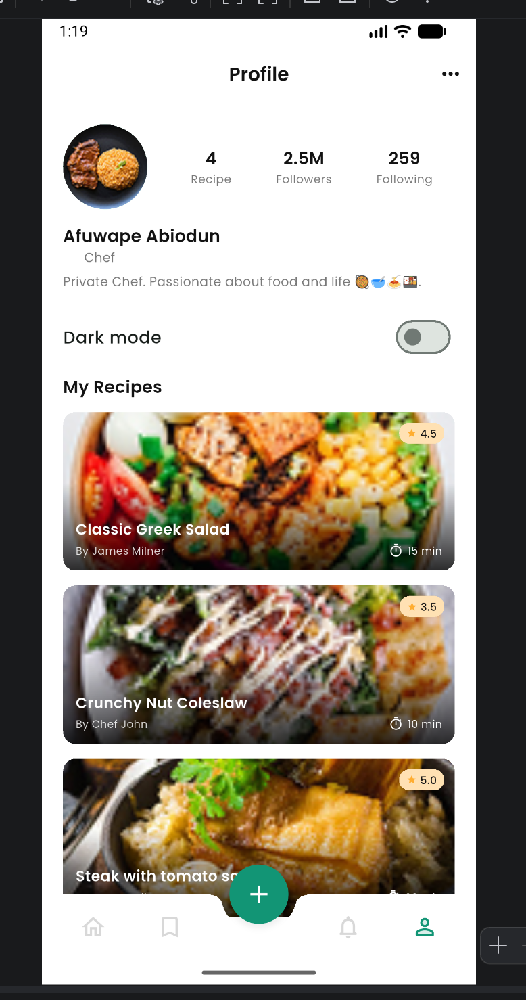

# Recipe Hub

[](https://github.com/Andassa/recip_hub/actions/workflows/flutter_ci.yml)
[](LICENSE)

App Flutter de recettes de cuisine. Les écrans suivent les maquettes Figma du projet. Licence : [MIT](LICENSE).

## Score checklist (brief Navigation et Routing)

| Exigence | Statut | Où |
| --- | --- | --- |
| 4+ écrans | OK | Home, Detail, Add Recipe, Favorites, Settings, Search… |
| go_router + routes nommées | OK | `lib/router/app_router.dart` |
| Shell + bottom nav / NavigationRail | OK | `lib/screens/shell_screen.dart` |
| Recherche + filtres | OK | `RecipeProvider` + Home / Search |
| Détail `/recipe/:id` | OK | `recipe_detail_screen.dart` |
| Formulaire 3 champs + validation | OK | `add_recipe_screen.dart` + `form_validators.dart` |
| Thème clair / sombre persisté | OK | `ThemeProvider` + Settings |
| 8+ widgets Flutter | OK | ListView, GridView, Stack, Card, Hero… |
| 3+ widgets réutilisables | OK | `recipe_card`, `search_bar_widget`, `category_chip` |
| Responsive mobile / tablette | OK | `isTablet` + NavigationRail + GridView |
| Pas de data hardcodée dans widgets | OK | repository + provider |
| Tests | OK | `test/` (unit + widget + router) et `integration_test/` |
| CI | OK | `.github/workflows/flutter_ci.yml` |

Détail du mapping : [docs/REQUIREMENTS.md](docs/REQUIREMENTS.md)

## Stack

- Flutter 3.x (null safety)
- go_router pour la navigation
- Provider pour l'état
- flutter_hooks pour l'état local de certains écrans
- shared_preferences pour le thème et la langue
- google_fonts (Poppins)

## Prérequis

- Flutter SDK 3.x installé (`flutter doctor`)
- Un émulateur Android / iOS, ou un appareil, ou Chrome

Vérifier Flutter :

```bash
flutter --version
flutter doctor
```

## Installation

```bash
git clone https://github.com/Andassa/recip_hub.git
cd recip_hub
flutter pub get
```

## Lancer l'application

```bash
flutter run
```

Choisir une plateforme :

```bash
flutter run -d chrome
flutter run -d macos
flutter run -d android
```

Pour tester le mode tablette, redimensionne la fenêtre au-delà de 600 px (plus petit côté), ou utilise un émulateur tablette. Tu dois voir le `NavigationRail` à gauche à la place de la bottom nav.

## Tests

```bash
flutter test
flutter analyze
dart format --set-exit-if-changed --output=none lib test integration_test
```

Couverture :

- unitaires : repository, provider, validateurs, responsive
- widgets : CategoryChip, DifficultyBadge, SearchBarWidget, AddRecipe form, RecipeCard
- router : résolution des routes nommées
- flows : sign-in then favorite, add recipe from the FAB
- integration : `integration_test/app_test.dart` and `integration_test/add_recipe_flow_test.dart`

Integration tests need a device or desktop target:

```bash
flutter test integration_test -d linux
```

On CI they run headless with `xvfb` in the `integration` job.

## Captures d'écran

### Splash


### Sign in


### Sign up


### Home


### Search


### Filter


### Détail recette (ingrédients)


### Menu More


### Share


### Rate


### Reviews


### Notifications


### Notification lue


### Favorites


### Add Recipe


### Profile


### Settings


## Structure

```
lib/
  main.dart
  theme/        couleurs et thèmes clair / sombre
  models/       Recipe, Review, Notification
  data/         repository et données mock
  providers/    RecipeProvider, ThemeProvider, LocaleProvider
  router/       GoRouter (routes nommées)
  screens/      tous les écrans
  widgets/      cartes, chips, nav, dialogs
  l10n/         ARB EN/FR
  utils/        isTablet, form validators, responsive
test/
  unit/         tests repository / provider / validators
  widgets/      tests UI réutilisables + formulaire
  flows/        parcours sign-in / favori / add recipe
  router/       tests routes nommées
integration_test/
docs/
  REQUIREMENTS.md
CHANGELOG.md
LICENSE
assets/
  images/
  icons/
  capture/
```

## Fonctionnalités

- Splash, Sign in, Sign up
- Home (catégories, popular, new recipes)
- Recherche et filtres (temps, note, catégorie)
- Détail recette (ingrédients, étapes, favori, share, rate)
- Reviews
- Favoris (Saved)
- Notifications
- Profile et Settings (thème clair / sombre et langue persistés)
- Formulaire d'ajout avec validation (titre, catégorie, durée)
- Responsive mobile et tablette (NavigationRail + GridView)

## Routes principales

- `/splash` : splash
- `/sign-in` / `/sign-up` : auth
- `/home` : accueil
- `/favorites` : favoris
- `/notifications` : notifications
- `/profile` : profil
- `/search` : recherche
- `/recipe/:id` : détail
- `/recipe/:id/reviews` : avis
- `/add-recipe` : ajout (formulaire validé)
- `/settings` : paramètres (toggle thème)

## Architecture

1. UI (`screens/`, `widgets/`) affiche les données
2. `providers/` détient l'état et appelle le repository
3. `data/recipe_repository.dart` lit / écrit les mocks
4. `models/` décrit les objets métier

Aucune liste de recettes n'est écrite dans un widget.

## Internationalization

The app ships English and French via `flutter_localizations` and ARB files in `lib/l10n/`. `MaterialApp.router` uses `localizationsDelegates` and `supportedLocales: [en, fr]`. Language is chosen in Settings and stored with `shared_preferences` (`LocaleProvider`), same pattern as the theme.

## Accessibility

Interactive controls that have no visible text expose a `Tooltip` or `Semantics` label: bottom navigation, add-recipe FAB, back/close/more/settings, favorite toggles, star ratings, and images (`semanticLabel` on splash, recipe photos, avatar, chef hat, ingredients). The sign-up terms checkbox is grouped with its label through `MergeSemantics`.

## Performance

- Local UI state on Search, Notifications, and Sign up uses `flutter_hooks` (`useState`, `useTextEditingController`) so `setState` does not rebuild unrelated screens.
- Home, Favorites, Search, Detail, Profile, and Reviews subscribe with `context.select` / `Selector` on the provider fields they actually read.
- Lists that were `ListView(children: ...)` (Notifications, Profile, Reviews, Settings) now use `ListView.builder`.
- Recipe and avatar `Image.asset` widgets pass `cacheWidth` / `cacheHeight` matching their on-screen size, plus an `errorBuilder`. Recipe JPEGs in `assets/images/` are all under 140 KB.

Frame-time check: scroll Home and Search on a physical phone or emulator with `flutter run --profile`, then enable the Performance Overlay (DevTools > Performance, or the overlay toggle). With the mock catalog (a handful of recipes) the overlay stayed in the green 16 ms band; there is no large network image list to jank on. Re-run that overlay after adding a bigger catalog.

## Download the CI APK

1. Open the [Actions](https://github.com/Andassa/recip_hub/actions) tab of the repository.
2. Select the **Flutter CI** workflow and open a green run on `main`.
3. In the `build_apk` job, download the **app-release** artifact (`app-release.apk`).

## Assets utiles

- Fond splash : `assets/images/splash_bg.jpg`
- Icône chef : `assets/icons/chef_hat.png`
- Photos recettes : `assets/images/recipe_1.jpg` à `recipe_4.jpg`
- Avatar : `assets/images/avatar.png`
- Captures : `assets/capture/`
